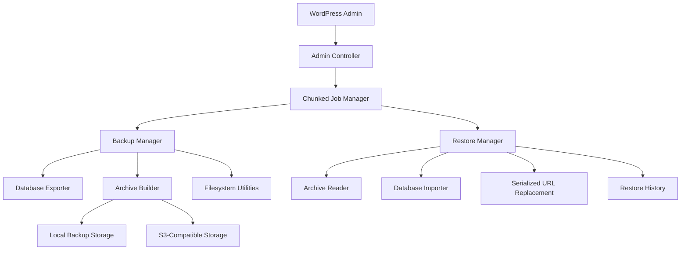

# Building a Reliable Backup, Restore, and Migration Plugin for WordPress

Backup Pilot is a free, open-source plugin by **Yousef Amer** built to demonstrate senior WordPress plugin engineering through a real operational product.

## Case Study Positioning

The goal is not only to ship a backup plugin. The goal is to show engineering judgment around trust, failure modes, destructive actions, WordPress data formats, long-running jobs, and administrator workflows.

CTA: Hire me for WordPress plugin development, migrations, maintenance tooling, audits, and custom integrations.

## The Problem

Backup plugins look simple from the outside: export files, export database, zip everything, restore later. In practice, reliable backup and migration tooling has hard edges:

- WordPress stores important values as serialized PHP data.
- Large sites hit timeout and memory limits.
- Restore operations are destructive.
- Backup archives can expose private files and database contents.
- File replacement can delete the plugin currently running the restore.
- Remote storage often adds credential and dependency risk.
- Administrators need clear validation before they trust a restore.

## The Solution

Backup Pilot uses a staged package model:

1. Create a ZIP package with `manifest.json`, `database.sql`, and managed files.
2. Validate package structure, metadata, checksums, and requirements.
3. Show source and current site details before restore.
4. Offer serialized-safe URL replacement when migrating between URLs.
5. Restore database and managed file paths through explicit confirmation.
6. Record restore history and preserve foundations for rollback.

## Architecture Diagram

## Hard Problems Highlighted

- **Serialized data**: Migration replacement must preserve string lengths and nested data structures.
- **Large-site chunking**: Backup and restore work needs resumable state instead of one fragile request.
- **Restore rollback**: Destructive workflows need restore history, staging, and rollback foundations.
- **Package validation**: Archives are untrusted input and must be checked before extraction or import.
- **Remote storage**: S3-compatible upload should work without turning the plugin into a dependency-heavy bundle.
- **WordPress cron**: Scheduled backup behavior must be predictable in real WordPress traffic conditions.
- **Security**: Capabilities, nonces, safe paths, and protected storage are central requirements, not polish.

## Screenshots To Add

- Backup history and manual create flow.
- Running chunked backup job.
- Restore validation screen.
- Migration URL replacement prompt.
- Settings, retention, diagnostics, and remote storage.

## Demo Video Outline

1. Create a backup.
2. Inspect backup history.
3. Download the ZIP.
4. Upload and validate the same package.
5. Show restore confirmation.
6. Demonstrate migration URL mismatch detection.
7. Show settings, retention, and S3-compatible storage.

## Testing Matrix

| Area | Test |
| --- | --- |
| Activation | Plugin activates and deactivates without fatal errors. |
| Backup | ZIP contains `manifest.json`, `database.sql`, and expected `files/` paths. |
| Exclusions | Backup storage, cache, logs, and temporary paths are excluded. |
| Restore | Package validates before destructive action. |
| Migration | Serialized-safe search/replace handles options and nested values. |
| Security | Unauthorized and nonced requests are rejected. |
| Compatibility | PHP `7.4`, `8.0`, `8.1`, `8.2`, `8.3+` where possible. |
| Standards | PHP lint, Composer validation, PHPUnit, and PHPCS. |

## Roadmap

- Harden PHPUnit coverage.
- Complete PHPCS pass.
- Add visual assets and demo media.
- Prepare WordPress.org submission.
- Expand rollback reliability.
- Add more remote storage providers after S3-compatible upload is proven.
